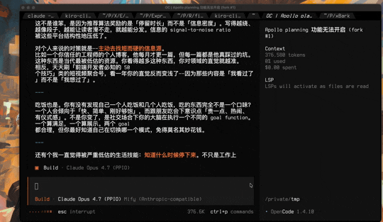

# xBark

Desktop sticker popup daemon. Say `:sticker[点赞]:` anywhere, see a sticker fly into the bottom-right of your screen.



Built on Tauri v2 + Rust. Single binary, ~5 MB. Ships with 82 curated meme stickers but you can bring your own.

## Features

- **Stacking popups**: multiple stickers stack up, oldest drop off after their duration
- **macOS Spaces aware**: the overlay follows you across virtual desktops
- **Click-through**: stickers don't block clicks on apps underneath
- **HTTP API**: send stickers from any script / any language
- **mDNS service discovery** (`_xbark._tcp`): locate a running daemon on the LAN
- **Fuzzy keyword resolution**: `:sticker[鼓掌]:` matches by tag, aiName, filename, or description
- **Auto-start daemon**: `xbark send` lazily spawns the daemon if it's not running
- **GIF support** (animated, plays natively in WKWebView)
- **Configurable**: TOML config for duration, size, sticker pack, etc.

## Quick start

```bash
# Build
cargo build --release --manifest-path src-tauri/Cargo.toml

# Send a sticker (spawns daemon on first call)
./target/release/xbark send 点赞

# List available stickers
./target/release/xbark list

# Custom duration
./target/release/xbark send 拿捏 --duration 5

# Check daemon status
./target/release/xbark status

# Stop daemon
./target/release/xbark stop
```

Install the binary to your PATH:

```bash
cp target/release/xbark /usr/local/bin/
```

## Configuration

Create `~/.config/xbark/config.toml` (or `$XDG_CONFIG_HOME/xbark/config.toml`):

```toml
# Default display time per sticker (seconds)
duration = 2.0

# Default size in pixels (square)
size = 256

# Max stickers visible simultaneously
max_visible = 5

# Custom sticker pack directory (must contain _meta.json)
# sticker_dir = "/path/to/stickers"
```

See `config.example.toml` for all options.

## Sticker packs

A sticker pack is a directory containing image files (`.jpg` / `.png` / `.gif` / `.webp`) and a `_meta.json` file describing them:

```json
{
  "getimgdata-8.jpg": {
    "filename": "getimgdata-8.jpg",
    "aiName": "smiling-man-thumbs-up",
    "description": "Man smiling with thumbs up",
    "tags": ["点赞", "认可", "微笑"]
  }
}
```

The bundled pack lives in `stickers/`.

## HTTP API

Once the daemon is running, it serves HTTP on `127.0.0.1:<random-port>`. The port is written to `$XDG_CONFIG_HOME/xbark/xbark.port` and also published via mDNS (`_xbark._tcp`).

```bash
PORT=$(cat ~/.config/xbark/xbark.port)

# Send by keyword
curl -X POST http://127.0.0.1:$PORT/sticker \
  -H 'Content-Type: application/json' \
  -d '{"keyword":"点赞","duration":3,"size":256}'

# Send by path (bypass resolver)
curl -X POST http://127.0.0.1:$PORT/sticker \
  -H 'Content-Type: application/json' \
  -d '{"path":"/path/to/image.gif"}'

# Clear all active stickers
curl -X POST http://127.0.0.1:$PORT/clear

# Health check
curl http://127.0.0.1:$PORT/health

# List stickers (optionally filtered)
curl http://127.0.0.1:$PORT/stickers?filter=点赞
```

## OpenCode plugin integration

xBark was originally built as an OpenCode sidekick: the AI writes `:sticker[点赞]:` in its reply, and xBark pops the image into your screen.

See `examples/opencode-plugin/sticker-notify.js` for a drop-in plugin:

```bash
ln -s "$(pwd)/examples/opencode-plugin/sticker-notify.js" \
  ~/.config/opencode/plugins/sticker-notify.js
```

## Architecture

```
┌────────────────────┐     POST /sticker        ┌─────────────────────────┐
│  OpenCode plugin   │  ───────────────────▶  │  xbark daemon (tokio)   │
│  xbark CLI         │                          │  ├── axum HTTP server   │
│  curl              │                          │  ├── mdns-sd publisher  │
│  anything          │                          │  └── Tauri app          │
└────────────────────┘                          │      └── overlay window │
                                                │          (WKWebView)    │
                                                └─────────────────────────┘
```

- Single Tauri `WebviewWindow` anchored to the bottom-right of the primary screen
- Frontend is plain HTML + CSS + JS (no framework), loaded via Tauri's `asset://` protocol
- Each sticker is an absolutely-positioned `<div>` inside an `.anchor` flexbox, using CSS keyframe animations
- Images are inlined as base64 data URLs to avoid filesystem scope issues
- HTTP server runs in a Tokio runtime on a separate thread from the Tauri main loop

## Known limitations

- **macOS only** for now. The Tauri window attributes used (`visible_on_all_workspaces`, transparent borderless) map cleanly to Windows/Linux, but this hasn't been tested yet
- **Position options** currently only `bottom-right` is fully functional. Other positions (`bottom-left`, `top-right`, `top-left`, `center`) need an overlay-per-anchor architecture change because the current overlay is only a 600px-wide slab at the right edge
- **No tray icon**. Looking into it
- **Autostart tested but limited**: `xbark autostart install` writes a launchd plist. Tested on macOS only; Windows/Linux equivalents not implemented

## License

MIT — see [LICENSE](./LICENSE).
